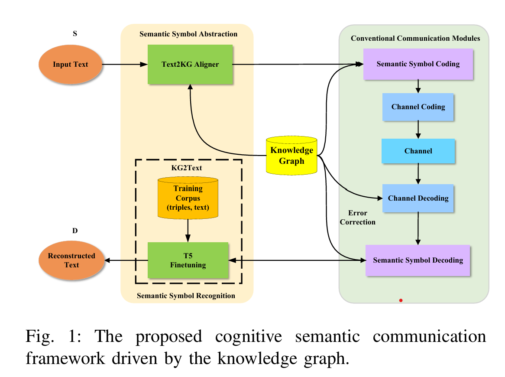

## Cognitive Semantic Communication Systems Driven by Knowledge Graph
- This repository provides a implementation of the paper [Cognitive Semantic Communication Systems Driven by Knowledge Graph: Principle, Implementation, and Performance Evaluation](https://ieeexplore.ieee.org/document/10262128)
- The repository covers WebNLG aligning, Knowledge Base error correction, T5 finetuning, T5 based KG-to-Text, and reproduces the main experimental figures in the paper.

## Architecture

## Preprocess
  python preprocess.py

## Channel
  python channel.py

## Train
  python train.py 

## Evaluation
  python eval.py

## Result
- bits vs sentence length

  

- bits vs number of texts

  

- Sentence Similarity vs p

	

- BLEU vs p

	
